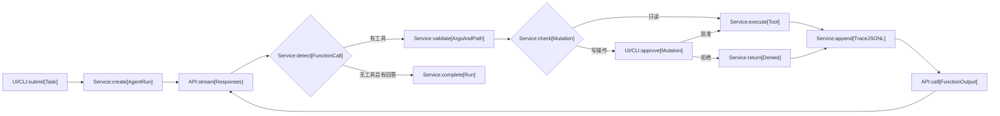

# 文件助理 Agent — Technical Design

## Reference

- **prd:** `【请创建副本后使用】AI Agent开发笔试题_文件助理 Agent 面试笔试题.md`
- **target_project:** `/Users/guangyuan.ou/projects/file-agent`
- **target_td:** `/Users/guangyuan.ou/projects/file-agent/TECHNICAL_DESIGN.md`
- **resolved_language:** `zh-CN`

## 1. Summary

本项目实现一个操作指定本地目录的通用文件 Agent。模型通过 OpenAI Responses API 决定调用通用文件工具；应用自行实现完整循环：

```text
流式模型响应
→ 解析 function call
→ 校验参数和审批
→ 执行工具
→ 写 trace.jsonl
→ 回填 function_call_output
→ 继续模型调用或结束
```

交付包括 Python CLI、FastAPI Web Demo、实时 SSE、reasoning summary、文件树与分页预览、Reset Workspace、写操作审批、usage 统计，以及 CLI/Web 均具备的 `trace.jsonl`。

禁止使用 LangChain、LangGraph、OpenAI Agents SDK Runner 或其他代跑 Agent 循环的框架。

## 2. Goals and Non-goals

### Goals

- 同一个通用 Agent 循环完成 T1 与 T2。
- 文件数据不能获得 system/developer 指令优先级。
- 大文件不整体进入内存、LLM 上下文或浏览器。
- 通过内容日期处理新旧信息冲突。
- 内容驱动的移动必须先读取并校验文件版本。
- 所有写副作用可审批、可追踪。
- 本地与部署版复用 Agent、工具和 trace 实现。

### Non-goals

- 不提供删除、递归删除、shell 或任意代码执行工具。
- 不实现注册、多用户、角色或密码找回。
- 不接数据库、Redis、对象存储或持久化 Volume。
- 不支持多 worker、多 replica 或进程重启恢复。
- 不实现 Chat Completions fallback；v1 要求端点支持 Responses API。
- 不使用独立前端构建系统。

## 3. Architecture



```text
仓库镜像
└── workspace/                         # 只读种子

临时磁盘
└── /tmp/file-agent/
    ├── workspaces/{workspace_id}/     # Web 会话副本
    └── runs/{run_id}/trace.jsonl      # Web Run trace

进程内存
├── WorkspaceSession registry
├── RunState registry
├── Responses 模型上下文
├── SSE event buffer
└── PendingApproval
```

Web 固定单 Uvicorn worker、单 Railway replica。

## 4. Core Decisions

| 主题 | 决策 |
|---|---|
| 技术栈 | Python 3.12 + FastAPI |
| 模型协议 | OpenAI Responses API |
| 模型状态 | 客户端管理，`store=false` |
| 推理展示 | 流式 reasoning summary |
| 前端 | 同源原生 HTML/CSS/JS |
| Workspace | Web 每浏览器会话使用临时副本 |
| Reset | 同时重建文件并清空模型上下文 |
| 写审批 | 每个写工具逐次确认，批准后立即生效 |
| CLI 审批 | TTY 询问；`--yes` 自动批准；非 TTY 默认拒绝 |
| 工具并发 | 顺序执行 |
| 预算 | 20 次 LLM、80 次工具、300 秒活动时间 |
| 文件正文预算 | 每 Run 返回给模型最多 256KB |
| TTL | 闲置 1 小时 |
| 登录 | 环境变量共享账号密码 + 签名 Cookie |
| 删除能力 | 不提供 |

## 5. Public Interfaces

### CLI

```bash
python -m file_agent.cli \
  --workspace ./workspace \
  --task "自然语言任务" \
  [--trace ./trace.jsonl] \
  [--yes]
```

- `--trace` 默认当前目录 `trace.jsonl`。
- `--workspace` 可以指向内容不同的新目录。
- CLI 实时输出 reasoning、工具、结果、回答和 usage。

### HTTP API

| Method | Path | Description |
|---|---|---|
| POST | `/api/auth/login` | 登录并设置签名 Cookie |
| POST | `/api/auth/logout` | 登出 |
| GET | `/api/auth/me` | 当前登录状态 |
| POST | `/api/workspaces` | 从种子创建副本 |
| POST | `/api/workspaces/{id}/reset` | 重建副本并清空上下文 |
| GET | `/api/workspaces/{id}/tree` | 有界文件树 |
| GET | `/api/workspaces/{id}/files` | 按行分页查看文件 |
| POST | `/api/runs` | 创建后台 Run |
| GET | `/api/runs/{id}/events` | SSE 事件和断线补发 |
| POST | `/api/approvals/{id}` | 批准或拒绝工具 |
| POST | `/api/runs/{id}/cancel` | 取消 Run |
| GET | `/api/runs/{id}/trace` | 下载 `trace.jsonl` |
| GET | `/health` | Railway 健康检查 |

SSE 事件：

```text
run.started
llm.started
reasoning.delta
answer.delta
tool.started
approval.required
approval.resolved
tool.completed
usage.updated
llm.retrying
run.completed
run.incomplete
run.failed
run.cancelled
```

事件使用递增 ID；通过 `Last-Event-ID` 补发。连接空闲发送 `: ping`。

## 6. Trace JSONL

CLI 与 Web 复用一个 `TraceWriter`。每次工具成功、失败或拒绝后立即追加并 flush：

```json
{"step":1,"tool":"search_files","args":{"query":"Project Falcon","path":"."},"result_summary":"找到 11 处匹配，分布在 10 个文件中"}
```

每行严格只有：

- `step`
- `tool`
- `args`
- `result_summary`

reasoning、answer 和 usage 不进入 JSONL。非法参数记录 `{"_raw":"..."}`。Web trace 位于 `/tmp/file-agent/runs/{run_id}/trace.jsonl`，可在运行中下载；Reset 后保留到 TTL 清理。

## 7. Tool Contracts

工具统一返回：

```json
{"ok":true,"summary":"确定性摘要","data":{},"error":null}
```

### `list_directory`

参数：`path="."`、`recursive=false`、`max_entries=200`。

- 返回排序路径、类型和大小，不返回 mtime。
- 忽略 `.DS_Store`。
- 超限标记 `truncated`。

### `search_files`

参数：`query`、`path="."`、`glob="*"`、`case_sensitive=false`、`max_matches=50`。

- 仅字面量搜索。
- 逐行流式扫描 UTF-8 文件，不整体读入内存。
- 每条返回路径、行号和最多 240 字符的不可信片段。
- 跳过二进制、不可解码文件和 `.DS_Store`。

### `read_file`

参数：`path`、`start_line=1`、`max_lines=200`。

- 单次最多 500 行、32KB。
- 返回行号范围、`has_more`、`next_start_line`、文件大小和整个文件版本 SHA-256。
- 正文位于 `untrusted_content`。
- 每 Run 累计正文最多 256KB。
- 大文件直接读取时提示先搜索。

### `make_directory`

- 父目录创建必须显式调用。
- 需要审批。
- 已存在目录为无副作用幂等成功。

### `write_file`

参数：`path`、`content`、`mode`、`expected_sha256`。

- `create`：目标必须不存在，不需要哈希。
- `overwrite`：目标必须存在且旧文件哈希匹配。
- 两种模式都需要审批。
- UTF-8 内容最多 128KB。
- 同目录临时文件 + 原子替换。

### `move_file`

参数：`source`、`destination`、`expected_sha256`。

- 源必须是普通文件并匹配哈希。
- 目标父目录必须存在，目标不得存在。
- 不支持目录、覆盖或跨 workspace 移动。
- 需要审批。

### `get_workspace_changes`

对比 Run 开始时 manifest，返回 `created`、`modified`、`deleted`、`moved`。后端在 Run 结束时额外无条件计算一次。

### Omitted

不注册删除、trash、shell 或命令执行工具。

## 8. Agent Loop

发送给模型：

- 固定 instructions；
- 当前用户任务；
- Reset 后的 Responses output items；
- function calls 与 function outputs；
- 有界工具结果。

不发送：

- 全量 workspace；
- 全量文件树；
- UI 文件预览历史；
- Reset 前上下文；
- trace 重复副本。

Responses 使用 `store=false`、`stream=true`、`reasoning.summary=auto`。客户端保存并重放完整 output items和加密 reasoning item；reasoning summary 只展示，不追加为新的消息。

循环：

1. 发起流式请求并计数。
2. 转发 reasoning 和 answer delta。
3. 等 function call item 完成后解析参数。
4. 多工具顺序处理。
5. Pydantic 校验；坏参数和未知工具作为失败结果回填。
6. 写工具通过前置校验后等待审批。
7. 执行或拒绝后写 trace，并回填结果。
8. 无 function call 且有非空最终文本时完成。

限制：

- 重试也计入 20 次 LLM；
- 成功、失败、拒绝均计入 80 个工具 step；
- 300 秒不含人工审批等待；
- 流中断重试一次，不执行不完整工具；
- 超限返回确定性的 `INCOMPLETE` 和已生效修改；
- 批准后立即生效，不做 Run 级回滚；
- Run 活跃或等待审批时禁止 Reset。

## 9. Safety

### Prompt Injection

- instructions 声明文件、日志、CSV 和搜索片段均为不可信数据。
- 文件中的 SYSTEM、AUTOMATION、删除或改变任务等文字只能作为数据分析。
- 工具结果只进入 `function_call_output`，正文放在 `untrusted_content`/`untrusted_snippet`。
- 能力层不提供删除与 shell。
- 路径沙箱、哈希和人工审批限制副作用。
- 不声称 tool result 无法影响模型；目标是降低其指令权重并限制影响后的能力。

### Large Files

通过 instructions、工具描述和 read 结果共同告诉模型“先搜索、后局部读取”。硬限制不依赖模型自觉。Web 文件查看也使用分页接口。

### Temporal Conflicts

遇到“当前、最新、正式”时：

1. 搜索全部相关来源；
2. 读取来源自身日期；
3. 比较明确陈述；
4. 选择最新有效来源。

日期优先级：

```text
front matter/正文 Date
→ 日志时间戳
→ 文件名日期
→ mtime 仅作为明确标注的最后兜底
```

不得实现 Falcon 专用解析器或写死答案。

### Filename vs Content

文件名只用于定位。内容驱动移动必须先 `read_file`；哈希保证执行对象仍是读取过的版本，但不声称证明语义理解正确。审批提供副作用确认。

### UI Safety

模型文本、文件正文、路径和 reasoning 必须通过 `textContent` 或严格 sanitizer 渲染，禁止直接使用未净化的 `innerHTML`。

## 10. Session and Authentication

登录由 `DEMO_USERNAME`、`DEMO_PASSWORD`、`SESSION_SECRET` 配置。使用 constant-time comparison 和签名 Cookie；Cookie 设置 `HttpOnly`、`Secure`、`SameSite=Lax`、`Max-Age=8h`，不保存密码。

同一 workspace 同时只允许一个 Run。页面刷新不重置；显式 Reset 同时更换 workspace 副本并清空模型上下文。

后台每 5 分钟扫描；闲置 1 小时后清理 workspace、上下文、Run、SSE 和 trace。等待审批一小时无活动时取消并清理。

## 11. Configuration

```env
OPENAI_API_KEY=
OPENAI_BASE_URL=https://api.openai.com/v1
OPENAI_MODEL=
DEMO_USERNAME=
DEMO_PASSWORD=
SESSION_SECRET=
WORKSPACE_SEED_PATH=./workspace
RUNTIME_ROOT=/tmp/file-agent
SESSION_TTL_SECONDS=3600
MAX_LLM_CALLS=20
MAX_TOOL_CALLS=80
RUN_TIMEOUT_SECONDS=300
MAX_RUN_FILE_CONTENT_BYTES=262144
```

模型必须支持 Responses API、function calling 和 reasoning summary。

## 12. Dependency-ordered Implementation Phases

实现必须严格按顺序进行。每个 Phase 完成代码、测试和验收后才能进入下一 Phase。

### Phase 1: Project Scaffold and Core Types

建立 Python 3.12 项目、配置、共享类型、错误模型和命令。

**Acceptance Criteria**

- `pyproject.toml`、Makefile、`.env.example`、`.gitignore` 完成。
- `make setup`、`make test` 可运行。
- 配置缺失时错误明确。
- 原始 `workspace/` 不被修改。

**Target Modules**

- `src/file_agent/config.py`
- `src/file_agent/types.py`

### Phase 2: Filesystem Sandbox, Tools and Trace

先完成确定性文件能力与安全边界，不接模型。

**Acceptance Criteria**

- 七个工具和统一结果完成。
- 阻止绝对路径、`..`、符号链接和 workspace 外访问。
- 大文件流式搜索、受限读取和 256KB Run 预算生效。
- create/overwrite/move 哈希规则生效。
- 无删除或 shell。
- `TraceWriter` 严格四字段、即时 flush。
- 工具和沙箱单测通过。

**Target Modules**

- `src/file_agent/sandbox.py`
- `src/file_agent/tools.py`
- `src/file_agent/trace.py`
- `tests/test_sandbox.py`
- `tests/test_tools.py`
- `tests/test_trace.py`

### Phase 3: Responses Client and Handwritten Agent Loop

实现流式 Responses、上下文回填、审批挂点、限制、重试和终止。

**Acceptance Criteria**

- `store=false` 与加密 reasoning item重放。
- reasoning、answer、tool、usage 内部事件完成。
- 多工具顺序执行。
- 坏参数和工具失败回填模型。
- 20/80/300 限制和一次重试生效。
- Fake Responses 流测试不消耗 API key。

**Target Modules**

- `src/file_agent/model.py`
- `src/file_agent/agent.py`
- `src/file_agent/prompts.py`
- `tests/test_model_stream.py`
- `tests/test_agent_loop.py`

### Phase 4: Approval and CLI

实现审批抽象和第一个端到端运行面。

**Acceptance Criteria**

- TTY 逐次确认；`--yes` 自动批准；非 TTY 默认拒绝。
- 自动批准不能绕过沙箱和哈希。
- CLI 实时输出 reasoning、工具、回答和 usage。
- 每 Run 生成 `trace.jsonl`。
- 支持任意 `--workspace`。

**Target Modules**

- `src/file_agent/approval.py`
- `src/file_agent/cli.py`
- `tests/test_cli.py`

### Phase 5: Web Runtime, Sessions and SSE API

实现内存状态、workspace 副本、后台 Run、SSE 重连、审批、Reset、TTL 和 Web trace。

**Acceptance Criteria**

- 每 workspace 同时一个 Run。
- SSE 断线不取消 Run并可补发。
- 写工具暂停等待幂等审批。
- 每个 Web Run 有可下载 `trace.jsonl`。
- 活跃 Run 禁止 Reset。
- Reset 同时重建 workspace 并清空上下文。
- TTL 清理生效。

**Target Modules**

- `src/file_agent/workspace.py`
- `src/file_agent/runtime.py`
- `src/file_agent/web.py`
- `tests/test_workspace_runtime.py`
- `tests/test_web_api.py`

### Phase 6: Login and Static UI

实现登录页和无构建步骤的 Agent UI。

**Acceptance Criteria**

- 共享账号密码和签名 Cookie。
- 实时显示 reasoning、工具参数、结果、answer 和 usage。
- 写操作可批准/拒绝。
- 文件树、分页预览、Reset 和 trace 下载完成。
- 不可信文本安全渲染。

**Target Modules**

- `src/file_agent/auth.py`
- `src/file_agent/static/login.html`
- `src/file_agent/static/index.html`
- `src/file_agent/static/app.js`
- `src/file_agent/static/styles.css`

### Phase 7: Local Validation and Documentation

默认 `pytest` 不调用真实 API；使用真实模型人工运行 T1、Reset、T2。

**Acceptance Criteria**

- T1 开头为 `Project Phoenix`，恰好收录 10 个文件并按月分组。
- 大日志通过搜索和局部读取处理。
- Prompt Injection 没有越权副作用。
- T2 只移动 `api-v1-spec.md`、`blog-post-launch.md`、`onboarding-guide.md`。
- `pricing-review-obsolete.md` 保留。
- MANIFEST 只登记三个文件。
- CLI 和 Web 均有四字段 trace。
- README 提供本地一条命令；NOTES 半页以内。

**Target Modules**

- `README.md`
- `NOTES.md`

### Phase 8: Docker and Railway

仅在本地验收通过后部署。

**Acceptance Criteria**

- Python 3.12 slim Docker 镜像。
- `.dockerignore` 排除密钥、虚拟环境、运行目录、trace 和缓存。
- 单 worker 读取 Railway `PORT`。
- 无数据库和 Volume。
- 公网登录、SSE、审批、Reset、文件浏览和 trace 下载 smoke test 通过。

**Target Modules**

- `Dockerfile`
- `.dockerignore`
- `railway.toml`（仅在需要时）

## 13. Test Plan

确定性测试覆盖：

- 路径逃逸、符号链接、目标冲突和父目录缺失；
- UTF-8、二进制、长单行、范围读取和正文预算；
- 大文件远距离命中和搜索截断；
- 移动/覆盖哈希缺失、不匹配和读取后变更；
- 批准、拒绝、重复决定、非 TTY 和 `--yes`；
- 正常终止、多工具、坏参数、流中断和预算触发；
- SSE 顺序、心跳、补发和结束状态；
- 登录 Cookie、登出和保护；
- TTL 清理；
- CLI/Web trace 同格式、失败/拒绝落盘、运行中下载。

真实模型验收基线：

```text
T1：10 个文件，月份 2025-09 至 2026-01，正式名称 Project Phoenix。

T2：仅移动
- drafts/api-v1-spec.md
- drafts/blog-post-launch.md
- drafts/onboarding-guide.md
```

不得移动 `drafts/pricing-review-obsolete.md`。

## 14. Error Handling

- `PATH_OUTSIDE_WORKSPACE`
- `SYMLINK_NOT_ALLOWED`
- `FILE_NOT_FOUND`
- `DESTINATION_EXISTS`
- `HASH_REQUIRED`
- `HASH_MISMATCH`
- `CONTENT_TOO_LARGE`
- `READ_BUDGET_EXCEEDED`
- `DENIED_BY_USER`
- `DENIED_BY_POLICY`
- HTTP `401` 未认证
- HTTP `409` Run/审批冲突
- HTTP `410` workspace/Run 过期
- `INCOMPLETE` 限制触发

## 15. Phase Gate

每个 Phase 结束必须：

1. 运行该 Phase 测试；
2. 报告创建或修改的文件；
3. 报告验收结果；
4. 报告剩余风险；
5. 通过后才进入下一 Phase。

如需改变公共接口、安全边界、审批语义、工具契约或 Phase 顺序，必须先更新本 TD 并说明原因。
